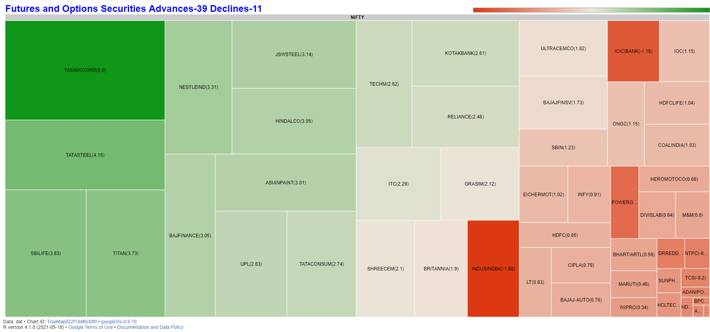
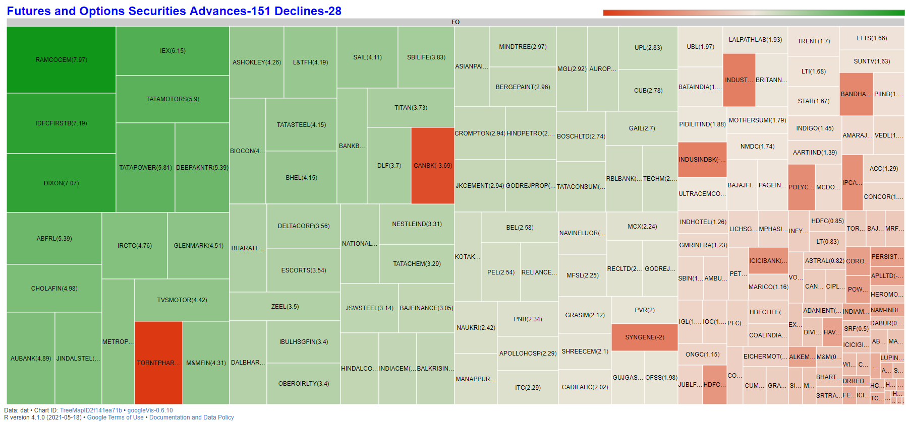

<!-- README.md is generated from README.Rmd. Please edit that file -->

<!-- badges: start -->

[](https://cran.r-project.org/package=nser)
[](https://cran.r-project.org/web/checks/check_results_nser.html)
[](https://lifecycle.r-lib.org/articles/stages.html#stable-1)

[](https://cran.r-project.org/package=nser)
<!-- badges: end -->

Latest Version: `1.3.4`(26-10-2021)


## New functions `nsetree`, `bhavfos`

* `daytoweek` Convert daily data of a stock to weekly data.

* `nsetree` Get a treeplot plot of NSE NIFTY 50 and FO securities. 

* `bhavfos` Download historical F&O Bhavcopy zip file through RSelenium. 

### NOTE 
* `optnifty`, `optbanknifty` are deprecated.


# Introduction

Welcome to “nser” packge. 

The packge helps you to download historical bhavcopy of Equities and F&O, get live market data, plot treemap of movement in securities and a lot more...


Package website [nser](https://nandp1.github.io/nser/)

## Installation

Install `nser` from [CRAN](https://cloud.r-project.org/web/packages/nser/index.html) by:

``` r
install.packages("nser")
```

Also install development version from github by:

``` r
install.packages("devtools")
library(devtools)
install_github("nandp1/nser")
```
## Here are few examples to get started, 

## Example 1. Downloading Historical Equity Bhavcopy

``` r
library(nser)
# Download Bhavcopy of 1st July 2021
bhav("01072021")
```
``` r
trying URL 'https://archives.nseindia.com/content/historical/EQUITIES/2021/JUL/cm01JUL2021bhav.csv.zip'
Content type 'application/zip' length 76717 bytes (74 KB)
downloaded 74 KB

       SYMBOL SERIES     OPEN     HIGH      LOW    CLOSE     LAST PREVCLOSE TOTTRDQTY    TOTTRDVAL   TIMESTAMP TOTALTRADES         ISIN  X
1   20MICRONS     EQ    60.45    60.75    59.20    59.45    60.50     60.15    149027 8.906267e+06 01-JUL-2021        1902 INE144J01027 NA
2  21STCENMGM     EQ    23.05    23.05    23.00    23.05    23.05     22.60     13436 3.096743e+05 01-JUL-2021         159 INE253B01015 NA
3   396GS2022     GS    81.38    81.38    81.38    81.38    81.38     77.51       100 8.138000e+03 01-JUL-2021           1 IN0020200260 NA
4  3IINFOTECH     BE    10.00    10.15     9.55     9.90     9.95      9.85   9271261 9.073657e+07 01-JUL-2021       10307 INE748C01020 NA
5     3MINDIA     EQ 24360.00 24599.35 24250.00 24315.35 24350.00  24331.55      1236 3.014403e+07 01-JUL-2021         774 INE470A01017 NA
6      3PLAND     EQ    12.90    13.40    12.30    12.95    13.05     12.95     16112 2.081200e+05 01-JUL-2021         111 INE105C01023 NA
7   522GS2025     GS   105.00   105.00   105.00   105.00   105.00    100.00         1 1.050000e+02 01-JUL-2021           1 IN0020200112 NA
8   585GS2030     GS   100.00   100.00   100.00   100.00   100.00     99.00       200 2.000000e+04 01-JUL-2021           1 IN0020200294 NA
9      5PAISA     EQ   419.00   424.00   417.00   418.95   419.00    416.75     10478 4.410485e+06 01-JUL-2021         449 INE618L01018 NA
10    63MOONS     BE    92.70    92.90    90.00    90.55    91.30     91.50     25650 2.338000e+06 01-JUL-2021         385 INE111B01023 NA
11  667GS2050     GS    99.60   101.00    99.50   101.00   101.00     99.97      1801 1.813960e+05 01-JUL-2021           7 IN0020200252 NA
12  676GS2061     GS    99.60   101.75    99.60    99.65    99.65     99.60       795 7.925725e+04 01-JUL-2021           4 IN0020200401 NA
13   68GS2060     GS   100.00   100.00   100.00   100.00   100.00    102.00       185 1.850000e+04 01-JUL-2021           2 IN0020200187 NA
14  716GS2050     GS   114.50   114.50   114.50   114.50   114.50    111.00         1 1.145000e+02 01-JUL-2021           1 IN0020200054 NA
15  719GS2060     GS   113.00   113.00   113.00   113.00   113.00    111.99         1 1.130000e+02 01-JUL-2021           1 IN0020200039 NA
```

## Example 2. Downloading Historical F\&O Bhavcopy

``` r
library(nser)
# Download Bhavcopy of 1st July 2021
fobhav("01072021")
``` 
``` r
trying URL 'https://archives.nseindia.com/content/historical/DERIVATIVES/2021/JUL/fo01JUL2021bhav.csv.zip'
Content type 'application/zip' length 593613 bytes (579 KB)
downloaded 579 KB

   INSTRUMENT     SYMBOL   EXPIRY_DT STRIKE_PR OPTION_TYP     OPEN     HIGH      LOW    CLOSE SETTLE_PR CONTRACTS VAL_INLAKH OPEN_INT CHG_IN_OI   TIMESTAMP  X
1      FUTIDX  BANKNIFTY 29-Jul-2021         0         XX 34975.75 35086.35 34810.85 34853.05  34853.05    105417  920286.40  2113400    -91225 01-JUL-2021 NA
2      FUTIDX  BANKNIFTY 26-Aug-2021         0         XX 35426.30 35426.30 34973.45 35004.70  35004.70      2041   17894.82    79450      3850 01-JUL-2021 NA
3      FUTIDX  BANKNIFTY 30-Sep-2021         0         XX 35303.05 35358.20 35128.85 35159.30  35159.30       264    2324.22    10300       425 01-JUL-2021 NA
4      FUTIDX   FINNIFTY 01-Jul-2021         0         XX 16480.00 16480.00 16368.50 16373.10  16376.85       112     735.46      600      -720 01-JUL-2021 NA
5      FUTIDX   FINNIFTY 08-Jul-2021         0         XX 16435.00 16435.00 16415.00 16415.00  16388.35         3      19.70      240       120 01-JUL-2021 NA
6      FUTIDX   FINNIFTY 15-Jul-2021         0         XX     0.00     0.00     0.00 15608.35  16399.80         0       0.00        0         0 01-JUL-2021 NA
7      FUTIDX   FINNIFTY 22-Jul-2021         0         XX     0.00     0.00     0.00 15935.80  16411.30         0       0.00        0         0 01-JUL-2021 NA
8      FUTIDX   FINNIFTY 29-Jul-2021         0         XX 16543.00 16552.05 16404.05 16439.55  16439.55       197    1298.45    11800         0 01-JUL-2021 NA
9      FUTIDX   FINNIFTY 05-Aug-2021         0         XX     0.00     0.00     0.00 16889.95  16436.80         0       0.00        0         0 01-JUL-2021 NA
10     FUTIDX   FINNIFTY 12-Aug-2021         0         XX     0.00     0.00     0.00 16776.10  16448.85         0       0.00        0         0 01-JUL-2021 NA
11     FUTIDX   FINNIFTY 18-Aug-2021         0         XX     0.00     0.00     0.00 16515.25  16459.15         0       0.00        0         0 01-JUL-2021 NA
12     FUTIDX   FINNIFTY 26-Aug-2021         0         XX 16475.00 16530.50 16429.85 16429.85  16429.85         8      52.77      480        40 01-JUL-2021 NA
13     FUTIDX   FINNIFTY 30-Sep-2021         0         XX     0.00     0.00     0.00 16553.45  16533.15         0       0.00      120         0 01-JUL-2021 NA
14     FUTIDX      NIFTY 29-Jul-2021         0         XX 15765.10 15775.05 15696.00 15710.60  15710.60    108225  851044.77  9676050     18650 01-JUL-2021 NA
15     FUTIDX      NIFTY 26-Aug-2021         0         XX 15820.10 15820.10 15746.00 15758.45  15758.45      2954   23295.81   468250     12750 01-JUL-2021 NA
```

## Example 3. Downloading today’s Equity and F\&O Bhavcopy

``` r
library(nser)
bhavtoday() # 26/10/2021
```
``` r
trying URL 'https://archives.nseindia.com/content/historical/EQUITIES/2021/OCT/cm26OCT2021bhav.csv.zip'
Content type 'application/zip' length 79180 bytes (77 KB)
downloaded 77 KB

       SYMBOL SERIES     OPEN     HIGH      LOW    CLOSE     LAST PREVCLOSE TOTTRDQTY    TOTTRDVAL   TIMESTAMP TOTALTRADES         ISIN  X
1   20MICRONS     EQ    56.75    59.00    56.75    57.85    58.05     56.90     67288 3.896562e+06 26-OCT-2021        1358 INE144J01027 NA
2  21STCENMGM     EQ    51.30    51.30    51.30    51.30    51.30     50.30      5576 2.860488e+05 26-OCT-2021          18 INE253B01015 NA
3   3IINFOLTD     BE    34.15    34.15    34.15    34.15    34.15     32.55     21632 7.387328e+05 26-OCT-2021         516 INE748C01038 NA
4     3MINDIA     EQ 25875.00 26350.00 25801.20 26146.75 25928.50  26146.90      2876 7.483434e+07 26-OCT-2021        1752 INE470A01017 NA
5      3PLAND     EQ    12.95    13.35    12.55    12.90    13.20     12.95      4708 6.041245e+04 26-OCT-2021         105 INE105C01023 NA
6   585GS2030     GS    98.51   102.00    98.51   102.00   102.00     98.63       101 9.953000e+03 26-OCT-2021           2 IN0020200294 NA
7      5PAISA     EQ   432.60   450.00   430.10   446.00   450.00    431.30     26127 1.157264e+07 26-OCT-2021        1859 INE618L01018 NA
8     63MOONS     EQ    94.90    95.70    93.50    93.95    94.00     94.15     61711 5.806464e+06 26-OCT-2021        1123 INE111B01023 NA
9   667GS2050     GS    98.00    98.00    97.01    97.87    97.87     97.01      9066 8.835410e+05 26-OCT-2021          16 IN0020200252 NA
10  676GS2061     GS    98.00    98.00    96.75    96.86    96.90     97.50      5516 5.366085e+05 26-OCT-2021          11 IN0020200401 NA
11   A2ZINFRA     EQ     4.35     4.70     4.25     4.70     4.70      4.30   1128374 5.116024e+06 26-OCT-2021         747 INE619I01012 NA
12    AAATECH     SM    60.00    60.00    60.00    60.00    60.00     61.85      3000 1.800000e+05 26-OCT-2021           1 INE0D0U01013 NA
13     AAKASH     EQ   187.10   190.30   186.25   189.05   186.30    186.85      3849 7.271254e+05 26-OCT-2021         166 INE087Z01016 NA
```
``` r
fobhavtoday() # 26/10/2021
```
``` r
trying URL 'https://archives.nseindia.com/content/historical/DERIVATIVES/2021/OCT/fo26OCT2021bhav.csv.zip'
Content type 'application/zip' length 861429 bytes (841 KB)
downloaded 841 KB

   INSTRUMENT     SYMBOL   EXPIRY_DT STRIKE_PR OPTION_TYP     OPEN     HIGH      LOW    CLOSE SETTLE_PR CONTRACTS VAL_INLAKH OPEN_INT CHG_IN_OI   TIMESTAMP  X
1      FUTIDX  BANKNIFTY 28-Oct-2021         0         XX 41214.90 41424.00 40876.05 41360.45  41360.45    121820 1255016.76  1290350   -116550 26-OCT-2021 NA
2      FUTIDX  BANKNIFTY 25-Nov-2021         0         XX 41405.40 41548.50 41012.10 41466.30  41466.30     44725  462093.16   843775    245250 26-OCT-2021 NA
3      FUTIDX  BANKNIFTY 30-Dec-2021         0         XX 41529.70 41666.35 41150.00 41601.55  41601.55      1771   18361.22    63225       775 26-OCT-2021 NA
4      FUTIDX   FINNIFTY 26-Oct-2021         0         XX 19581.70 19683.85 19460.05 19643.75  19651.10       133    1041.76     2480      -400 26-OCT-2021 NA
5      FUTIDX   FINNIFTY 02-Nov-2021         0         XX     0.00     0.00     0.00 19201.70  19664.90         0       0.00       40         0 26-OCT-2021 NA
6      FUTIDX   FINNIFTY 09-Nov-2021         0         XX     0.00     0.00     0.00 18274.65  19678.75         0       0.00        0         0 26-OCT-2021 NA
7      FUTIDX   FINNIFTY 16-Nov-2021         0         XX     0.00     0.00     0.00 18477.90  19692.55         0       0.00        0         0 26-OCT-2021 NA
8      FUTIDX   FINNIFTY 23-Nov-2021         0         XX 19769.95 19779.95 18650.10 19765.00  19765.00        20     157.02      640       160 26-OCT-2021 NA
9      FUTIDX   FINNIFTY 30-Nov-2021         0         XX 19905.00 19905.00 19508.00 19625.05  19625.05        12      94.15      400       120 26-OCT-2021 NA
10     FUTIDX   FINNIFTY 07-Dec-2021         0         XX     0.00     0.00     0.00 18459.25  19738.80         0       0.00        0         0 26-OCT-2021 NA
11     FUTIDX   FINNIFTY 28-Dec-2021         0         XX     0.00     0.00     0.00 18480.35  19782.80         0       0.00        0         0 26-OCT-2021 NA
12     FUTIDX      NIFTY 28-Oct-2021         0         XX 18180.05 18350.00 18108.10 18314.15  18314.15    167070 1522358.11  7159900  -2026150 26-OCT-2021 NA
13     FUTIDX      NIFTY 25-Nov-2021         0         XX 18205.00 18387.95 18150.10 18342.75  18342.75     85205  777990.13  4821000   1745300 26-OCT-2021 NA
14     FUTIDX      NIFTY 30-Dec-2021         0         XX 18280.00 18450.00 18235.00 18415.50  18415.50      3450   31639.35   618350      8600 26-OCT-2021 NA
15     FUTSTK   AARTIIND 28-Oct-2021         0         XX  1007.90  1021.15  1006.00  1016.30   1016.30      2295   19767.79  1562300   -719100 26-OCT-2021 NA
```


## Example 4. Live F&O data.
``` r
library(nser)
nselive()
```
``` r
Advances 39

Declines 11

Time Oct 26, 2021 15:59:52

       SYMBOL     OPEN     HIGH      LOW      LTP Change pChange Volume (lacs) Turnover (crs) 52 week High 52 week Low Previous CLOSE    CLOSE
1  TATAMOTORS   483.50   510.00   483.25   508.20  28.30    5.90        580.28        2904.46       530.00      130.00         479.90   508.65
2   TATASTEEL  1303.00  1351.00  1301.45  1347.00  53.70    4.15         77.23        1025.28      1534.50      395.20        1293.30  1343.65
3     SBILIFE  1135.00  1178.30  1134.00  1173.00  43.30    3.83         15.73         182.86      1273.90      755.25        1129.70  1172.05
4       TITAN  2390.00  2468.45  2371.00  2468.00  88.85    3.73         25.67         623.58      2677.90     1154.00        2379.15  2454.75
5    JSWSTEEL   678.70   697.45   674.50   695.40  21.15    3.14         42.39         290.38       776.50      299.60         674.25   694.35
6    HINDALCO   475.05   488.00   472.55   487.70  14.45    3.05         81.20         391.04       551.85      165.30         473.25   486.05
7  BAJFINANCE  7695.00  7894.95  7651.10  7880.00 233.35    3.05         16.61        1293.83      8050.00     3236.65        7646.65  7855.65
8  ASIANPAINT  2918.05  3024.00  2898.00  3006.00  87.95    3.01         19.88         582.71      3505.00     2070.05        2918.05  2969.80
9         UPL   695.00   716.45   693.60   715.00  19.70    2.83         14.75         104.59       864.70      399.00         695.30   713.25
10 TATACONSUM   786.10   811.90   786.10   810.60  21.65    2.74         17.77         142.28       889.00      470.15         788.95   808.90
```

## Example 5. Pre market open data of F&O stocks
``` r
library(nser)
nseopen("fo")
```
``` r
Advances - 125

Declines - 35

No Change - 20

        SYMBOL    Price Change pChange Prev.Close Quantity Value(in lakhs) FFM Caps(crs.) 52 Week High 52 Week Low
1    NAM-INDIA   425.00  -8.20   -1.89     433.20     8324           35.38        6987.15       476.45      267.10
2    ICICIBANK   828.70 -13.00   -1.54     841.70   130920         1084.93      583589.03       867.00      388.05
3          SRF  2069.45 -32.05   -1.53    2101.50     3365           69.64       30503.43      2538.00      858.01
4      HDFCAMC  2728.00 -40.70   -1.47    2768.70     3105           84.70       15344.42      3365.00     2225.90
5   SRTRANSFIN  1500.10 -16.80   -1.11    1516.90      842           12.63       30578.84      1558.80      670.00
6        TECHM  1571.90  47.80    3.14    1524.10   119614         1880.21       94588.27      1576.50      781.85
7     INDIACEM   198.00   4.75    2.46     193.25    54066          107.05        2635.06       227.85      114.95
8         IDEA    10.60   0.20    1.92      10.40  1193432          126.50        8367.75        13.80        4.55
9        L&TFH    82.35   1.15    1.42      81.20    45524           37.49        6425.55       113.40       58.22
10        ONGC   163.55   2.15    1.33     161.40   203754          333.24       58883.25       172.75       64.10
11       SUNTV   567.05   7.15    1.28     559.90    16843           95.51        5516.20       586.55      407.80
12  INDUSTOWER   292.00   3.45    1.20     288.55    71335          208.30       23328.72       332.80      175.25
13         CUB   178.35   2.10    1.19     176.25    37141           66.24       12631.09       200.00      142.55
14  HINDUNILVR  2468.90  28.05    1.15    2455.85     4089          100.95      219269.26      2859.30     2043.00
15       IRCTC  4068.00  45.65    1.13    4022.35    18547          754.49       21238.01      6396.30     1290.05
```

## Example 6. Current and Upcoming IPO's
``` {r example}
library(nser)
nseipo()
```
``` r
  Equity /IPO Name    Type    Rating     Issue Price Issue Size (in crores) Lot Size Open Date Close Date
1   FSN E-Commerce     IPO Not Rated 1,085.00-1,125.        5184.03 - 5375.       12    28-Oct     01-Nov
2  Nidan Laborator SME IPO Not Rated          125.00                     50     1000    28-Oct     02-Nov
```

## Example 7. RSelenium to Download Equity Bhavcopy
``` r
library(nser)
library(RSelenium)

# Start a selenium server and browser
# For Google Chrome (Update Chrome to latest version)

 driver <- rsDriver(browser = c("chrome"), port = 3163L, chromever = "91.0.4472.101")
 remDr <- driver$client

# or for Firefox
 driver <- rsDriver(browser = c("firefox"), port = 3799L)
 
# Download Equity Bhavcopy zip file
bhavs("03012000", 2)

# Close the Browser
remDr$close()

```

## Example 8. RSelenium to Download F&O Bhavcopy
``` r
library(nser)
library(RSelenium)

# Start a selenium server and browser
# For Google Chrome (Update Chrome to latest version)

 driver <- rsDriver(browser = c("chrome"), port = 3163L, chromever = "91.0.4472.101")
 remDr <- driver$client

# or for Firefox
 driver <- rsDriver(browser = c("firefox"), port = 3799L)
 
# Download Equity Bhavcopy zip file
bhavfos("03012000", 2)

# Close the Browser
remDr$close()

```

## Example 9. NSE Treemap 
``` r 
library(nser)
# NIFTY 50 stocks (26/10/2021)
nsetree()
```


### F&O stocks  (26/10/2021)
```
nsetree("fo") 
```


## Example 10. Daily data to Weelkly data
``` r 
library(nser)
data(dailydata)
daytoweek(dailydata)
```
``` r
    SYMBOL   OPEN   HIGH    LOW  CLOSE weekstartdate weekenddate
1     SBIN 250.10 262.00 244.35 260.95    2019-10-09  2019-10-11
2     SBIN 256.95 271.35 254.00 255.45    2019-10-14  2019-10-18
3     SBIN 270.40 284.95 248.65 270.50    2019-10-22  2019-10-27
4     SBIN 283.15 317.80 278.55 280.65    2019-10-29  2019-11-01
5     SBIN 316.00 323.30 312.35 314.30    2019-11-04  2019-11-08
6     SBIN 314.70 323.70 299.70 318.25    2019-11-11  2019-11-15
7     SBIN 324.00 333.80 322.10 325.10    2019-11-18  2019-11-22
8     SBIN 329.00 351.00 328.35 336.10    2019-11-25  2019-11-29
9     SBIN 343.90 344.60 318.00 338.50    2019-12-02  2019-12-06
10    SBIN 318.95 333.45 308.00 316.70    2019-12-09  2019-12-13
11    SBIN 335.95 339.50 324.50 331.85    2019-12-16  2019-12-20
```


